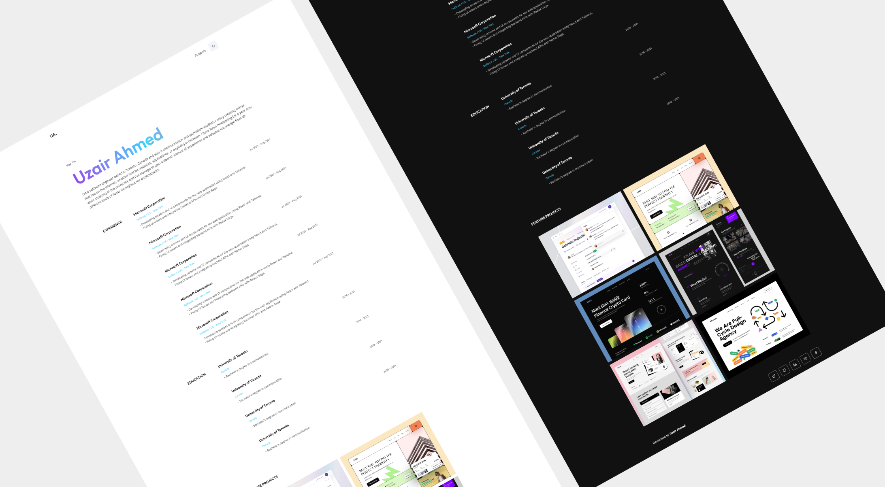

<<<<<<< HEAD

# eliasnowak.github.io

# Portfolio Website - Astro

Just change `src/data/info.ts` to get your personal portfolio.

## portfolio template for Developers!



## 🚀 Project Structure

Inside of your Astro project, you'll see the following folders and files:

```
/
├── public/
│   ├── assets
│   │   ├── fonts
|   |   └── images
│   └── favicon.ico
├── src/
│   ├── components/
│   │   ├── home/
|   |   └── general/
|   |       ├── Header.astro
|   |       ├── Footer.astro
|   |       └── ...
│   ├── data/
│   ├── layouts/
│   |   |── Layout.astro
│   |   └── ...
│   ├── pages/
│   |   ├── peojects.astro
│   |   ├── index.astro
│   ├── styles/
│   |   |── custom-styles.css
│   |   |── fonts.css
│   |   └── styles.css
│   ├── types/
│   ├── utils/
├── package.json
└── ...
```

Astro looks for `.astro` or `.md` files in the `src/pages/` directory. Each page is exposed as a route based on its file name.

There's nothing special about `src/components/`, but that's where we like to put any Astro/React/Vue/Svelte/Preact components.

Any static assets, like images, can be placed in the `public/assets` directory.

Your personal data would be go on `src/data` directory.

## 🧞 Commands

All commands are run from the root of the project, from a terminal:

| Command                | Action                                           |
| :--------------------- | :----------------------------------------------- |
| `npm install`          | Installs dependencies                            |
| `npm run dev`          | Starts local dev server at `localhost:3000`      |
| `npm run build`        | Build your production site to `./dist/`          |
| `npm run preview`      | Preview your build locally, before deploying     |
| `npm run astro ...`    | Run CLI commands like `astro add`, `astro check` |
| `npm run astro --help` | Get help using the Astro CLI                     |

## 👀 Want to learn more?

Feel free to check [Astro documentation](https://docs.astro.build) or jump into Astro [Discord server](https://astro.build/chat).

> > > > > > > master
